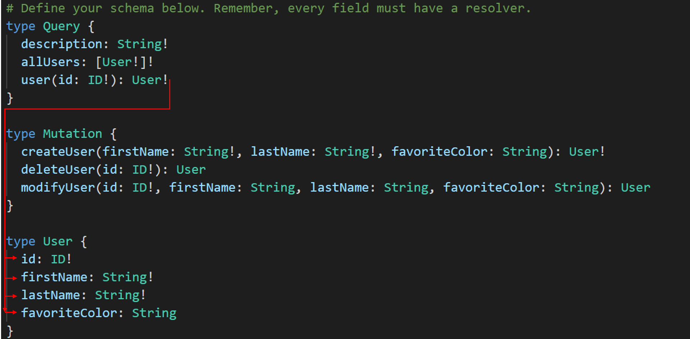

# GraphQL

## schema.graphql
This is where you will define your desired schema. Each field in the schema must have a corresponding resolver (defined in /src/index.js).

'Query' and 'Mutation' are called root types. If a root field is of a user-defined type (e.g., 'user()' must return an object of type User), then the flow is as follows:
* resolver for the root field is executed ('user(id: ID!): User')
* an object of type User is returned
* resolvers for the fields on the User object are executed



As an important note, the end results of a GraphQL query must be scalar types. In the example above, the user() query does not return the object because it is a User type, so the next level-down of resolvers are executed and return scalar types (ID, string). 

## index.js
The users object is intended only as dummy data. The data for the API is stored only in-memory--if you would like to configure a connection to a database, please refer to https://www.howtographql.com/graphql-js/4-adding-a-database/ to learn how to set up Prisma client.

The resolvers object defines how your queries will be executed. Think of these as basic function definitions which contain the logic of what should happen when the queries are performed.

Every resolver receives 4 arguments:
* **root / parent**--contains the result of the parent field's resolver
* **args**--the arguments passed to the field in the query you wrote
* **context**--shared by all resolvers in the query. Allows resolvers to communicate
* **info**--contains information about the execution state of the query, including the field name, path to the field from the root

<!-- # Prisma
Prisma is used to connect GraphQL to a persistent data store.

To set up Prisma locally, follow the steps below.

1. Run the following commands
```
npm install -g prisma
prisma init database
```

2. Select the desired option


3. Generate the Prisma client with 
```
prisma generate
``` 

4. Make sure Docker is installed on your machine. Modify docker-compose.yml according to the needs of your connection.


Now, you can use the Prisma client by including the following line at the top of your files:
```
const { prisma } = require('./generated/prisma-client')
``` 
## datamodel.prisma
Files ending in .prisma use GraphQL schema definition language (SDL) so this will look very similar to your schema.graphql file. The '@id' directive in datamodel.prisma tells Prisma to autogenerate a GUID for records of type Link. Similarly, '@createdAt' tells Prisma to autogenerate a timestamp for the 'createdAt' field.

## prisma.yml
This file points Prisma to the HTTP endpoint for your API, the Prisma datamodel, and specifies which language the client should be generated in and where it should be located (https://www.howtographql.com/graphql-js/4-adding-a-database/). -->


## Sources
* https://www.howtographql.com/
* https://www.prisma.io/docs/1.34/get-started/01-setting-up-prisma-new-database-JAVASCRIPT-a002/